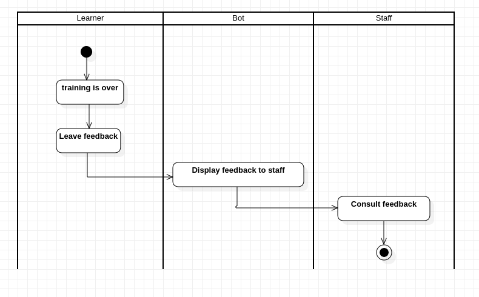

# Sommaire

- <a href='#usecase-diagram'>Diagramme de cas d'utilisation</a>
- <a href='#activities-diagram'>Diagramme d'activités</a>
- <a href='#sequences-diagram'>Diagramme de séquences</a>
- <a href='#classes-diagram'>Diagramme de classes</a>

# Diagramme de cas d'utilisation 

Le diagramme de cas d'utilisation représente les cas d'utilisation possibles d'une application de façon générale et très peu détaillée : 

## Explication du diagramme

Ce présent diagramme indique qu'un membre du **Staff** peut consulter un feedback, ce qui implique que le **Bot** affiche le feedback au membre du **Staff**.
Afin de permettre l'affichage du feedback, un apprennant (représenté ici par l'acteur **Learner**) doit au préalable envoyer un feedback, pour se faire
le bot doit mettre à disposition de l'**Apprenant** un **encart** dédié à l'envoi d'un feedback.

# Diagramme d'activités 

Le diagramme d'activités représente les différentes activités d'une application de façon générale et peu détaillée, il est conçu à partir du <a href='#usecase-diagram'>**diagramme de cas d'utilisation**</a>

## Explication du diagramme

Ce présent diagramme indique qu'un **Apprenant** rejoint un canal dédié à l'envoi d'un **feedback** concernant la formation qu'il a suivi, l'apprenant reçoit alors un encart permettant de laisser son **feedback**, le **bot** l'enregistre alors et demande à **Discord** d'afficher un message notifiant à l'**Apprenant** que son feedback à bien été enregistré.

# Diagramme de séquences 

# Diagramme de classes <a id='classes-diagram'>