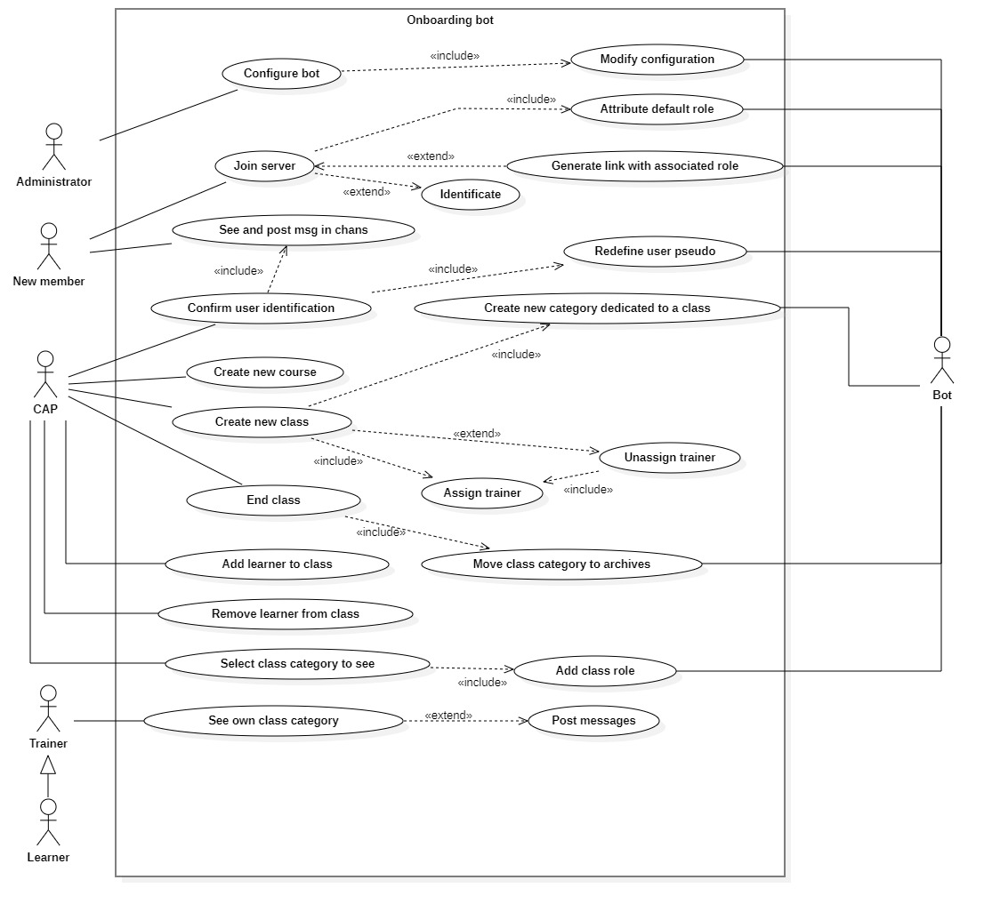
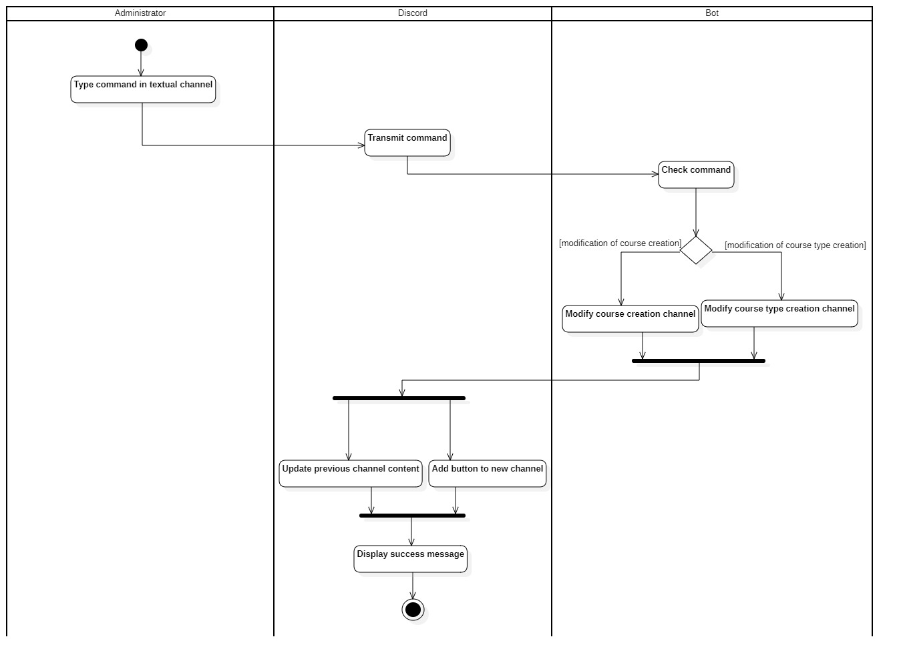
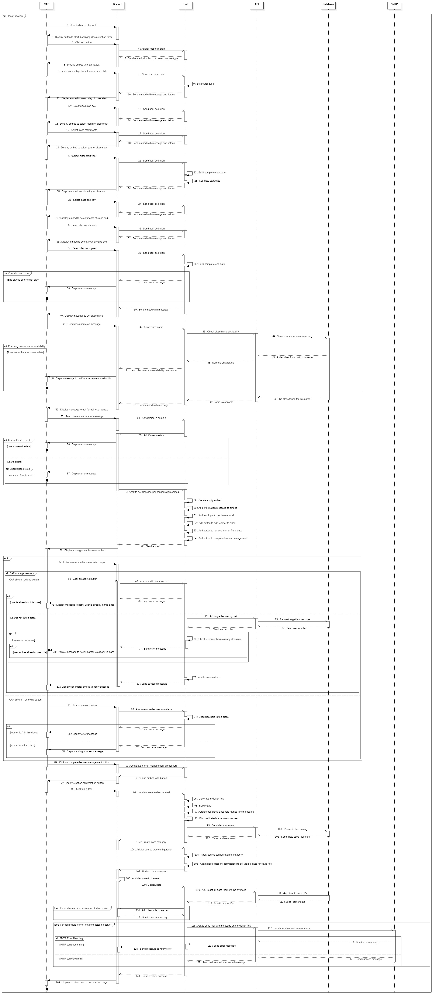
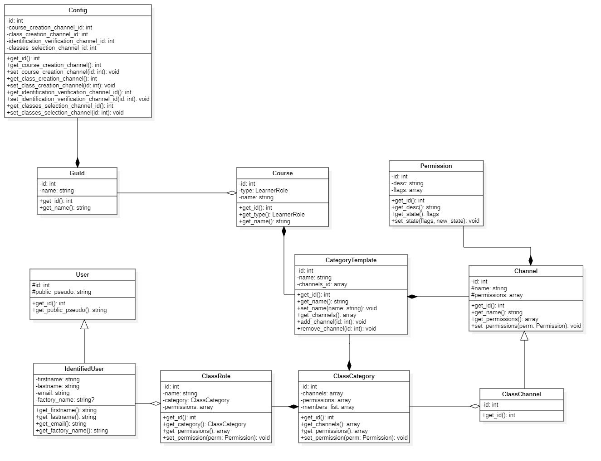

# Sommaire

- <a href='#context'>Contexte</a>
- <a href='#usecase-diagram'>Diagramme de cas d'utilisation</a>
- <a href='#activities-diagram'>Diagramme d'activités</a>
  - <a href='#activities-course-creation'>Création d'une nouvelle formation</a>
  - <a href='#activities-class-creation'>Création d'une nouvelle promotion</a>
  - <a href='#activities-user-join'>Utilisateur rejoignant le serveur</a>
  - <a href='#activities-identification-request-verification'>Consultation des demandes d'identifications</a>
  - <a href='#activities-select-class'>Selection des promotions à afficher ou non</a>
  - <a href='#activities-configure-bot'>Configuration du bot par un **Administrateur**</a>
- <a href='#sequences-diagram'>Diagramme de séquences</a>
  - <a href='#sequences-course-creation'>Création d'une nouvelle formation</a>
  - <a href='#sequences-class-creation'>Création d'une nouvelle promotion</a>
  - <a href='#sequences-user-join'>Utilisateur rejoignant le serveur</a>
  - <a href='#sequences-identification-request-verification'>Consultation des demandes d'identifications</a>
  - <a href='#sequences-select-class'>Selection des promotions à afficher ou non</a>
  - <a href='#sequences-configure-bot'>Configuration du bot par un **Administrateur**</a>
- <a href='#classes-diagram'>Diagramme de classes</a>

# Contexte 

Le **Bot d'Onboarding** doit permettre de gérer de façon globale l'import d'un éco-système de Centre de Formation au sein d'un seul et unique serveur **Discord**, 
dans cette optique, le **Bot** doit permettre d'accueillir de nouveaux membres internes ou externes au Centre de Formation.

Il doit permettre de définir qu'un utilisateur est un **Apprenant** ou un **Membre des différentes équipes** du Centre de Formation de la façon la plus simple possible, pour permettre l'accueil des différentes promotions, le **Bot** doit mettre à disposition un espace dédié à une promotion.

Aussi, le **Bot** doit permettre la création de nouvelles formations ainsi que la création de nouvelles promotions de façon la plus simple possible,
il doit aussi permettre aux membres concernés de consulter ces différents espaces si nécessaire tout en conservant une navigation fluide au sein du serveur **Discord**

# Diagramme de cas d'utilisation 

Le diagramme de cas d'utilisation représente les cas d'utilisation possibles d'une application de façon générale et très peu détaillée : 

Dans ce présent diagramme :

L'administrateur (représenté ici par **Administrator**) peut configurer le **Bot** ce qui implique que le **Bot** modifie sa configuration.

Un nouveau membre (représenté ici par **New Member**) peut rejoindre le serveur ce qui implique que le **Bot** lui attribut un rôle par défaut,
aussi, il est possible que le **Bot** ait généré un lien d'invitation auquel il a associé un rôle à attribué à l'utilisateur.
Aussi, le nouveau membre peut ou doit s'identifier selon le lien d'invitation avec lequel il a rejoint le serveur **Discord**.

Le nouveau membre peut poster des messages dans les canaux globaux, et il peut poster des messages dans les canaux liés à son rôle ce qui implique,
qu'il se soit identifié.

Le CAP peut confirmer les demandes d'identification des nouveaux membres, ce qui implique que le **Bot** doivent redéfinir le pseudo du nouvel utilisateur,
le cap peut aussi créer un nouveau type de formation, il peut créer une nouvelle promotion, il doit pour cela assigner au moins un formateur à la promotion, pour créer une nouvelle promotion le **Bot** doit créer un espace dédié à la promotion.

Le CAP peut aussi mettre fin à un promotion en cours, ce qui implique que le **Bot** doit déplacer la catégorie liée à la promotion vers une zone d'archivage,
le cap peut aussi ajouter ou supprimer un apprenant d'une promotion.
Il peut aussi selectionner les promotions qu'il veut consulter ce qui implique que le **Bot** doit ajouter ou retirer un rôie au **CAP**.

Le formateur (représenté ici par **Trainer**) peut quant à lui consulter l'espace dédié à sa promotion et y discuter librement.
L'apprenant (représenté ici par **Learner**) peut lui aussi consulter son espace de formation et y discuter librement.

# Diagramme d'activités 

Le diagramme d'activités représente les différentes activités d'une application de façon générale et peu détaillée, il est conçu à partir du <a href='#usecase-diagram'>**diagramme de cas d'utilisation**</a>

## Création de formation 

Ce présent diagramme décrit les activités possibles lors de la création d'une nouvelle formation : 

Un **CAP** rejoint le canal dédié à la création d'une formation, **Discord** affiche donc un bouton afin de d'afficher au **CAP** une interface de création de formation.
Le **CAP** clique sur le bouton et entre les différentes caractéristiques de la formation puis valide la demande de création d'une formation.
Le **Bot** vérifie les informations entrées par le **CAP**, si une erreur est detectée, il le notifie au **CAP**, sinon il récupère les IDs des canaux globaux prévus pour servir de canaux de templates, puis il créer un template de formation.
Enfin **Discord** va notifier le succès de la création de la formation au **CAP**

## Création d'une nouvelle promotion 

Ce présent diagramme décrit les activités possibles lors de la création d'une nouvelles promotions :

Un **CAP** rejoint le canal dédié à la création d'une promotion, **Discord** affiche donc un bouton afin de donner au **CAP** une interface de création de promotion.
Le **CAP** clique sur le bouton et entre les différentes caractéristiques de la promotion puis valide la demande de création de promotion.
Le **Bot** vérifie les informations entrées par le **CAP**, si une erreur est detectée, il le notifie au **CAP¨**, sinon le **Bot** récupère le template du type de formation,
puis il créer un rôle de promotion ainsi qu'une catégorie (un espace) dédié à la promotion à laquelle il lie un lien d'invitation.
Il attribue le rôle de promotion au **CAP** qui a crée la promotion.
Alors **Discord** applique le template de formation à la catégorie de la promotion et lie le rôle de promotion à la catégorie.
Ensuite le **Bot** va lié le rôle de promotion à chaque apprenant.
Enfin **Discord** va notifier le succès de la création de la promotion au **CAP**

## Utilisateur rejoignant le serveur 

Ce présent diagramme décrit les activités possibles lorsce qu'un **nouvel utilisateur** rejoint le serveur **Discord**

Le **Nouvel utilisateur** clique sur le lien d'invitation
**Discord** récupère une demande d'entrer sur le serveur, il met alors à jour sa liste de membres.
Le **Bot** vérifie alors le lien d'invitation afin de determiner si le lien à un rôle associé ou non, si le lien n'a pas de rôle associé alors il attribue le rôle **Invité**
sinon, **Discord** affiche un formulaire sous forme de Pop-up afin de permettre au **Nouvel utilisateur** de s'identifier, à l'issue du remplissage de ce formulaire d'identification, le **Bot** envoi un message dans le canal dédié aux vérifications d'identités puis **Discord** affiche le message et envoi un message afin de notifier la prise en compte de sa demande d'identification au **Nouvel utilisateur**.
Enfin **Discord** attribue le rôle **Invité** au **Nouvel utilisateur** le temps que la demande d'identification de ce dernier soit acceptée.

## Consultation des demandes d'identifications 

Ce présent diagramme décrit les activités possibles lorsce qu'un **CAP** veut consulter valider ou refuser une demande d'identification

Le **CAP** rejoint le canal prévu à cet effet, **Discord** renvoi alors toutes les demandes d'identifications des **nouveaux utilisateurs**.
Le **CAP** clique alors sur l'un des deux boutons (**Accepter** ou **Refuser**).
Le **Bot** analyse si le **CAP** à cliquer sur **Accepter**, alors, il attribue le rôle associé au lien d'invitation avec lequel l'utilisateur à rejoint le serveur **Discord** et notifie le **nouvel utilisateur** que sa demande d'identification à été acceptée.
Si le **CAP** à cliquer sur le bouton **Refuser** il notifie simplement au **nouvel utilisateur** que sa demande d'identification à été refusée.
Enfin **Discord** passe la demande d'identification en état **Fermée** afin de désactiver les intéractions avec la demande d'identification.

## Selection des promotions à afficher ou non 

Ce présent diagramme décrit les activités possibles lorsce qu'un **CAP** veut selectionner une promotion à voir ou non

Le **CAP** rejoint le canal prévu à cet effet, **Discord** affiche alors un bouton sur lequel le **CAP** clique.
Le **Bot** analyse si le **CAP** s'est affilié à une **Fabrique** lors de son identification, si c'est le cas,
le **Bot** récupère toutes les promotions affiliées à la **Fabrique**, si ce n'est pas le cas alors il récupère,
toutes les promotions en cours puis demande à **Discord** d'afficher un bouton pour chaque promotion récupérée.

Le **CAP** clique sur le bouton d'une promotion, le **Bot** vérifie alors si le **CAP** a déjà le rôle de la
promotion, si c'est le cas, il lui retire ce qui a pour effet de désactiver l'affichage de l'espace de promotion.
Si ce n'est pas le cas, le **Bot** ajoute le rôle de la promotion au **CAP** ce qui a pour effet d'afficher
l'espace de promotion.

## Configuration du bot par un **Administrateur** 

Ce présent diagramme décrit les activités possibles lorsce qu'un **Administrateur** veut configurer le bot

**L'administrateur** tape une commande dans un canal (peu importe le quel), **Discord** transmet la commande au **Bot**,
Le **Bot** vérifie la commande entrée, s'il s'agit d'une commande pour modifier le canal pour la création des promotions, alors il modifie cette entrée dans sa configuration
sinon, il modifie l'entrée pour la création de formation.
Ensuite **Discord** nettoie le précedent canal et affiche l'interface liée à la commande dans le canal spécifié dans la commande.
Enfin **Discord** affiche un message de succès à **l'administrateur**

# Diagramme de séquences 

Le diagramme de séquence représente les différentes activités d'une application de façon très détaillée, il est conçu à partir du <a href='#activities-diagram'>**diagramme d'activités**</a>

## Création d'une nouvelle formation 

## Création d'une nouvelle promotion 

## Utilisateur rejoignant le serveur 

## Consultation des demandes d'identifications 

## Selection des promotions à afficher ou non 

## Configuration du bot par un **Administrateur** 

# Diagramme de classes 

Le diagramme de classe représente les différentes classes d'une application, ce diagramme doit être utilisé lors de la phase de développement afin de permettre aux développeurs de savoir la façon dont doit être développer l'application. 

Dans ce diagramme nous avons une classe nommé **Config** qui est utile afin de configurer le **Bot**, elle compose la classe **Guild**
qui représente le **Serveur Discord** qui aggrege une la classe **Course** qui représente une formation.

La classe **CategoryTemplate** compose cette même classe **Course** et représente la façon dont doit-être agencé une **catégorie Discord** selon son type de **Course** (Formation)
La classe **Course** représente une formation
La classe **ClassCategory** compose la classe **CategoryTemplate** et est l'instanciation de la classe **CategoryTemplate**
La classe **ClassCategory** aggrère la classe **ClassChannel** qui est  l'instanciation des canaux pour la promotion
La classe **ClassChannel** généralise (hérite) de la classe **Channel** qui est la représentation d'un **canal Discord**
La classe **Permission** compose la classe **Channel**, cette classe permet de définir les permissions des différents rôles selon le **canal Discord**
La classe **ClassCategory** compose la classe **Class** qui représente une promotion dans son ensemble
La classe **ClassRole** compose elle aussi la classe **Class**, elle représente le rôle associé à chaque promotion
La classe **ClassRole** est associé à la classe **IdentifiedUser** qui représente un utilisateur identifié sur le **serveur Discord**
La classe **IdentifiedUser** généralise (hérite) **User** qui représente un utilisateur lambda