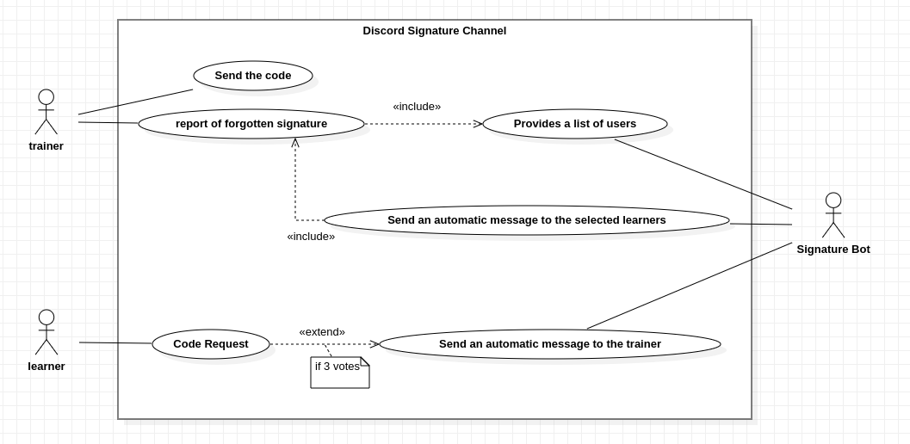
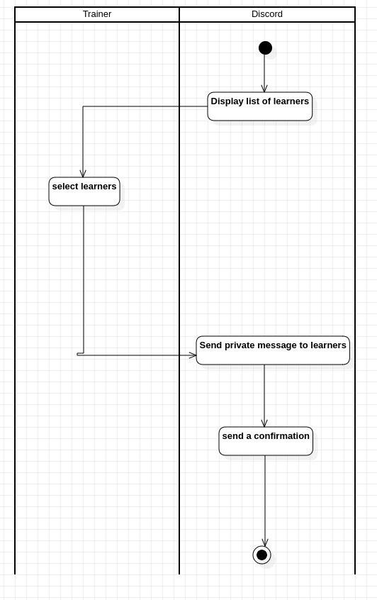
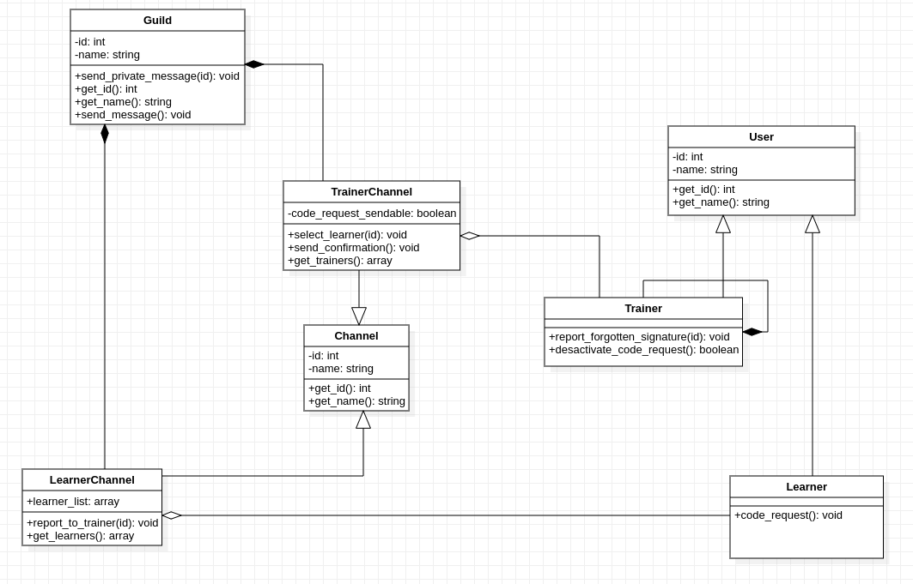

# Sommaire

# Bot de gestion des signatures

This document is about to explain the different diagrams you can find in this repository about our Signature Discord Bot. 
Dans ce document, nous expliquerons les différents diagrammes que vous pourrez trouver dans ce repository Git à propos du Bot de gestion des signatures. 

## Le diagramme des Use Cases

Premièrement, notre diagramme des use cases a ét&é construit à partir des règles de gestion de notre application. Les besoins utilisateurs y sont répertoriés ainsi que leurs interactions avec le système. 

## Le diagramme d'activité

Construit à partir du diagramme des use cases, le diagramme d'activité illustre les activités effectuées par les acteurs du système. Dans un soucis de clareté, nous avons choisis de représenter les différentes utilisations. 

### Le formateur prévient l'apprenant de son oubli de signature

Le formateur entre dans un cannal spécifique afin de sélectionner les apprenants d'une formation pour les prévenir qu'ils n'ont pas signé. En fin d'action, une confirmation est envoyée.

### L'apprenant demande le code au formatteur

L'apprenant envoie un rappel à son formateur. Au bout de trois rappels (de trois apprenants différents), le bot envoie un message de rappel au formateur. 

### Le formateur désactive la fonction de demande

Lorsque le code a été fournis aux apprenants, le formateur demande au bot à ce que la fonction de rappel soit désactivée pour la demi-journée. 

## Les diagrammes de séquence

Construit à partir de nos diagrammes d'activités, le diagramme de séquence représente la temporalité des actions des différents acteurs de l'application. 
De même que pour les diagrammes d'activités, nous avons choisi de découper l'action en différentes séquences. 

### Le formatteur prévient l'apprenant de son oubli de signature

Le formatteur entre dans le channel. Le bot lui affiche une liste des apprenants. Le formateur sélectionne les apprenants auxquels envoyer des rappels. Un message de rappel leur est envoyé. Un message de confirmatuion est envoyé au formateur. 

### Le formateur désactive la fonction de rappel

Le formateur clique sur un bouton afin de désactiver la fonction de rappel pour ses apprenants

### L'apprenant demande à son formateur le code

L'apprenant clique sur le bouton de rappel. Le bot reçoit la demande et check si l'apprenant a déjà cliqué sur le bouton. 

## Le diagramme de classe

Construit selon les précédents diagrammes, le diagramme de classe a pour but de représenter notre application finale selon les lois de l'orienté objet. 

