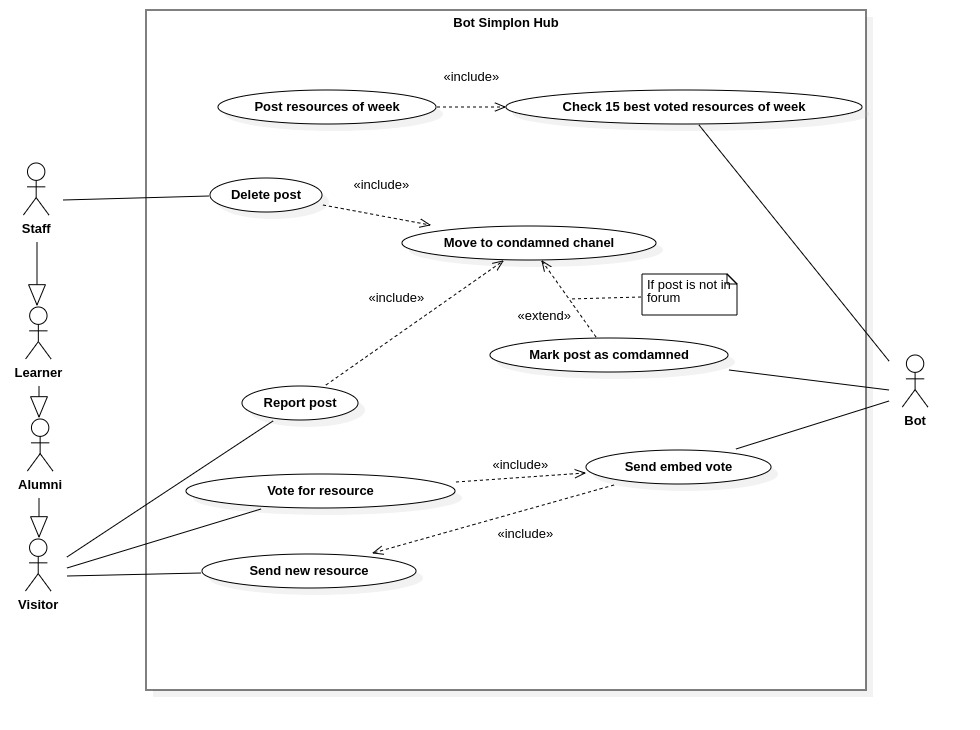

# Sommaire

- <a href='#usecase-diagram'>Diagramme de cas d'utilisation</a>
  - <a href='#basic-usecase'>Basique</a>
  - <a href='#config-usecase'>Configuration</a>
- <a href='#activities-diagram'>Diagramme d'activités</a>
- <a href='#sequences-diagram'>Diagramme de séquences</a>
- <a href='#classes-diagram'>Diagramme de classes</a>

# Diagramme de cas d'utilisation 

Le diagramme de cas d'utilisation représente les cas d'utilisation possibles d'une application de façon générale et très peu détaillée : 

## Cas d'utilisation : Basique 

Ce présent diagramme illustre les différents actions possibles par les différents acteurs :

## Cas d'utilisation : Configuration 

# Diagramme d'activités 

# Diagramme de séquences 

# Diagramme de classes 

