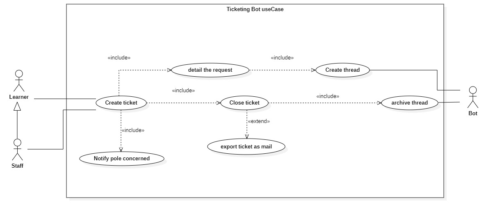
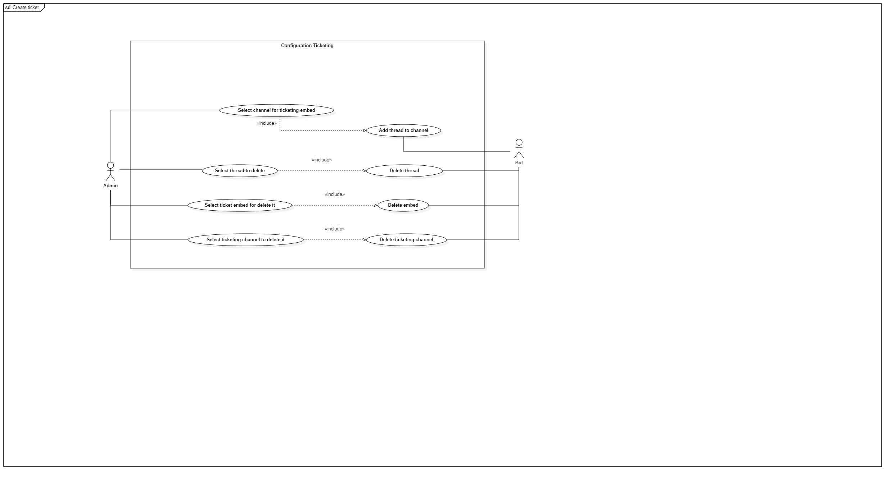
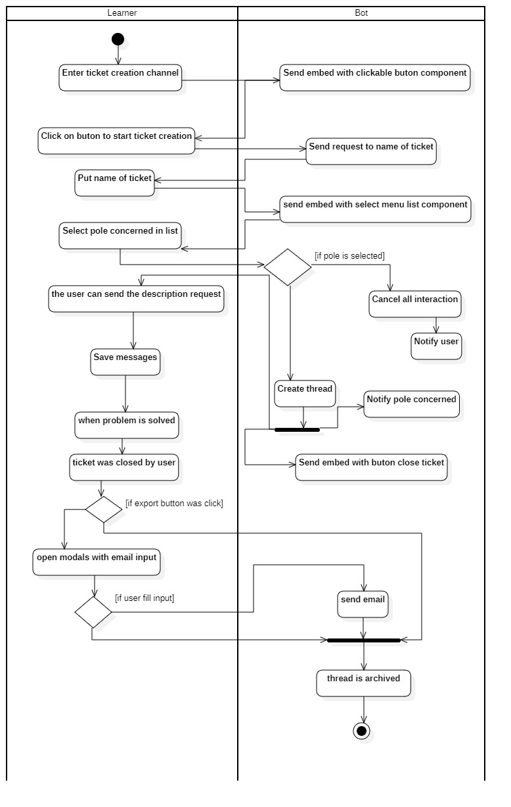
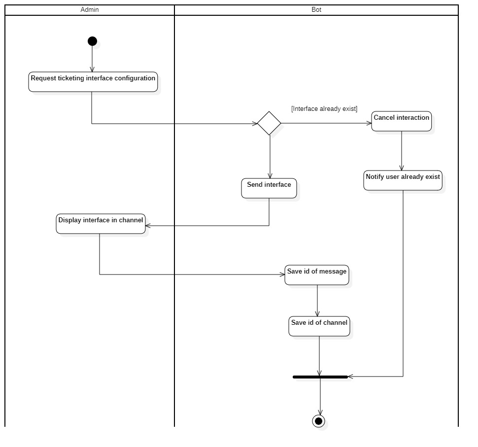
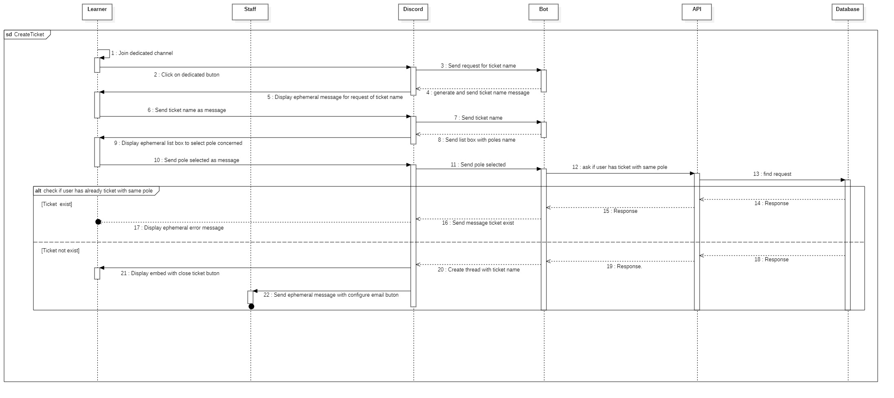
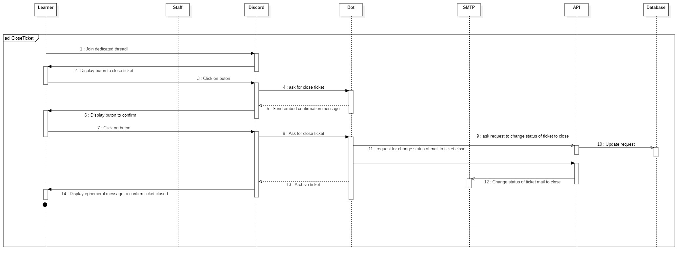
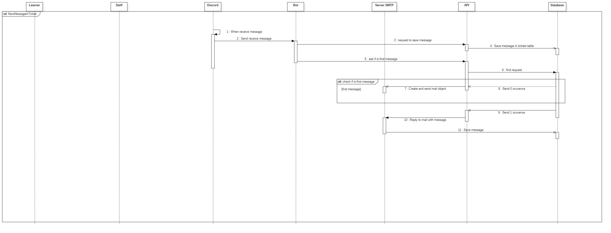
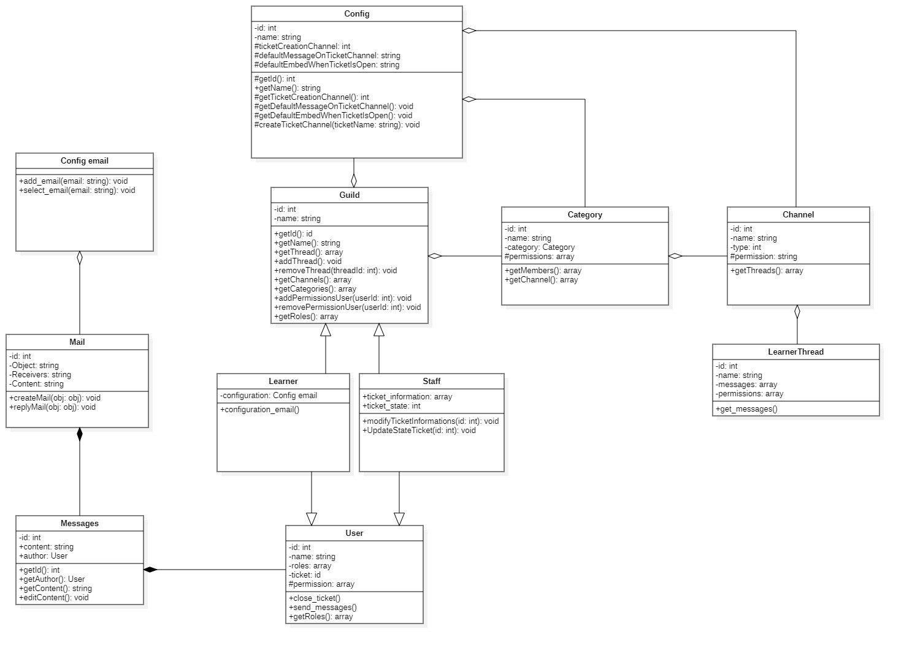

# Sommaire

- <a href='#context'>Contexte</a>
- <a href='#usecase-diagram'>Diagramme de cas d'utilisation</a>
  - <a href='#usecase-basic'>Basique</a>
  - <a href='#usecase-config'>Configuration du bot</a>
- <a href='#activities-diagram'>Diagramme d'activités</a>
  - <a href='#activities-create-ticket'>Création d'un nouveau ticket</a>
  - <a href='#activities-bot-configuration'>Configuration du bot</a>
- <a href='#sequences-diagram'>Diagramme de séquences</a>
  - <a href='#sequences-bot-configuration'>Configuration du bot</a>
  - <a href='#sequences-create-ticket'>Création d'un nouveau ticket</a>
  - <a href='#sequences-close-ticket'>Fermeture d'un ticket existant</a>
  - <a href='#sequences-new-message-in-ticket'>Nouveau message dans un ticket</a>
- <a href='#classes-diagram'>Diagramme de classes</a>

# Contexte 

Le **Bot de ticketing** doit permettre aux utilisateurs du **serveur Discord** de créer des tickets lorsce qu'ils rencontrent un problème que l'organisme de formation est en mesure de résoudre.
Par exemple, dans le cadre d'un problème rencontré par un **Apprenant** dans le cadre de sa rémunération, ce dernier peut créer un ticket à adresser aux **membres des équipes administratives** dans lequel il détaillera son problème.

De plus, le **Bot de ticketing** doit permettre la traçabilité des tickets, tant sur le serveur **Discord** que dans un contexte de conservation par **mail**.

# Diagramme de cas d'utilisation 

Le diagramme de cas d'utilisation représente les cas d'utilisation possibles d'une application de façon générale et très peu détaillée : 

## Basique 

Un apprenant (représenté ici par l'acteur **Learner**) peut créer un ticket ce qui implique qu'il doit détailler sa requête, cela implique aussi que le **Bot** créer un **Thread** (ou fil de discussion)
La création du ticket implique aussi la **fermeture** du ticket, ce qui implique que le **Bot** archive le fil discussion.
La création du ticket implique aussi la notification du **Pôle concerné**
La **fermeture** du ticket implique aussi un export en tant que mail.

## Configuration du Bot 

# Diagramme d'activités 

Le diagramme d'activités représente les différentes activités d'une application de façon générale et peu détaillée, il est conçu à partir du <a href='#usecase-diagram'>**diagramme de cas d'utilisation**</a>

## Création d'un nouveau ticket 

## Configuration du Bot 

# Diagramme de séquences 

Le diagramme de séquence représente les différentes activités d'une application de façon très détaillée, il est conçu à partir du <a href='#activities-diagram'>**diagramme d'activités**</a>

## Configuration du Bot 

**Missing**

## Création d'un nouveau ticket 

## Fermeture d'un ticket existant 

## Nouveau message dans un ticket 

# Diagramme de classes 

Le diagramme de classe représente les différentes classes d'une application, ce diagramme doit être utilisé lors de la phase de développement afin de permettre aux développeurs de savoir la façon dont doit être développer l'application. 

